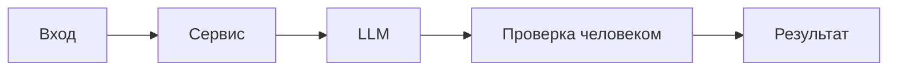

# ADR: решение для первого рабочего сценария

- Статус: proposed / accepted
- Дата: 2026-09-18
- Ответственные: продакт, разработчик, аналитик, тестер, ПМ

## Контекст

AI‑помощник ревьюера PR получает diff и должен возвращать проверяемый, связный и безопасный результат. Нужен архитектурный контракт, учитывающий правила SEC-1, API-1, REL-1, OUT-1, SCOPE-1, QA-1, OBS-1.
## Решение

Ввести master prompt с Context Pack и структурой OUT-1; валидировать входной diff по API-1; соблюдать таймаут REL-1; исключить секреты по SEC-1; логировать только метаданные OBS-1; включать риски по QA-1.
## Рассмотренные альтернативы

| Альтернатива | Почему не выбрали сейчас |
|---|---|
| Свободный текст без контракта | Нет воспроизводимости и проверок |
| Полная автоматизация approve/merge | Нарушает SCOPE-1, повышает риски |

## Последствия и главный риск

- Положительные последствия:
- Ограничения:
- Главный риск:
- Как проверим риск:

## Архитектурная схема

## Как использовали AI

- Для чего: зафиксировать архитектурное решение и последствия.
- Тип промпта: master prompt (P1-02).
- Строка в [`prompts.md`](prompts.md): P1-02.
- Что проверили и исправили сами: проверили согласованность с CASE.md, актуализировали схему и последствия.
- Положительные последствия: ускорение ревью, повышение доказательности, снижение шумов.
- Ограничения: максимум три риска; качество зависит от входного diff.
- Главный риск: ложная уверенность при неполном контексте.
- Как проверим риск: ручное сопоставление evidence с diff и правилами; негативные кейсы (большие диффы, таймауты).
