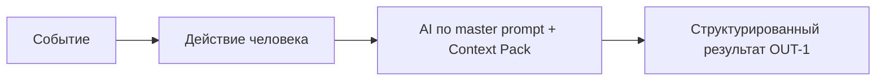

# Анализ процесса: AS IS и TO BE

## AS IS

Сейчас ревьюер самостоятельно анализирует diff и формулирует замечания. При использовании AI без чётких правил модель выдаёт свободный текст без гарантированной структуры и evidence. Потери времени возникают на проверке утверждений и уточнении контекста. Риски: утечка секретов, пропуск граничных случаев, разные форматы выходов.
## TO BE

После введения master prompt и Context Pack AI возвращает структурированный JSON (OUT-1) с подтверждёнными рисками (QA-1) и шагами проверок. Ревьюер валидирует и принимает решение. Сокращаются итерации уточнений и проверок.

## Разница

| Что меняется | AS IS | TO BE | Как проверим изменение |
|---|---|---|---|
| Формат ответа | Свободный текст | JSON OUT-1 | Парсер + визуальная проверка |
| Доказательность | Неполная | Каждый риск с evidence | Ручная проверка по diff |
| Время ревью | Дольше | Коротьше | Замеры на пилоте |

## Как использовали AI

- Для чего: описать изменения процесса и целевое состояние.
- Тип промпта: master prompt (P1-02).
- Строка в [`prompts.md`](prompts.md): P1-02.
- Что проверили и исправили сами: синхронизировали термины с Context Pack, уточнили точки измерений.
