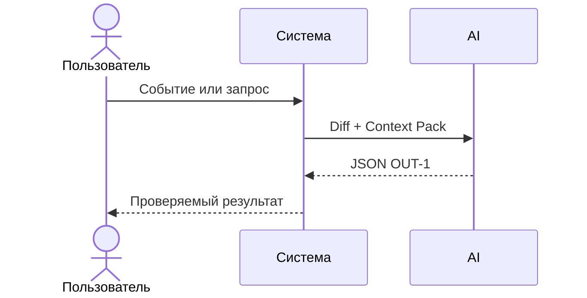

# Use cases и user stories

## Первый рабочий сценарий

**Когда** ревьюер прикладывает diff PR, **система** анализирует его по master prompt и Context Pack, **а пользователь получает** краткое summary, до трёх подтверждённых рисков и список проверок.

Не входит в этот сценарий:

- Автоматический merge/approve; генерация кода; внешние действия в GitHub.

## Use case

| Поле | Значение |
|---|---|
| Актор | Ревьюер PR |
| Триггер | Появился diff PR |
| Предусловия | Доступен diff; сервис доступен; настроен мастер‑промпт |
| Основной результат | Структурированный ответ OUT‑1 |
| Ошибка или отказ | Нет подтверждённых рисков или превышен лимит API‑1 |



## User stories и acceptance criteria

```gherkin
Feature: Ревью PR с помощью AI

  Scenario: Позитивный
    Given есть валидный unified diff PR
    When система отправляет diff в AI с Context Pack
    Then ответ соответствует OUT-1 и каждый риск подтверждён evidence

  Scenario: Негативный или граничный
    Given diff превышает 20000 символов
    When запрос отправляется
    Then возвращается контролируемая ошибка (HTTP 413) без утечки содержимого
```

## Как использовали AI

- Для чего: оформить сценарий, use case и критерии приёмки.
- Тип промпта: master prompt (P1-02).
- Строка в [`prompts.md`](prompts.md): P1-02.
- Что проверили и исправили сами: согласовали формулировки с Context Pack и CASE.md; добавили негативный сценарий.
