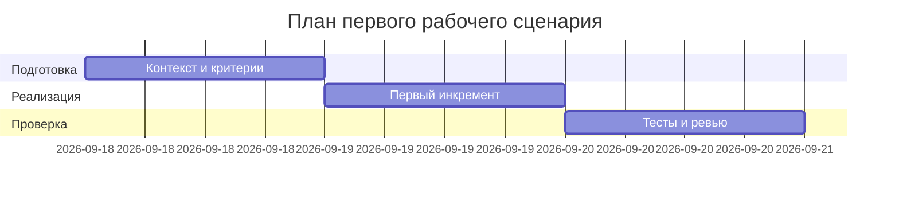

# План поставки

## Инкременты и ответственность

| Инкремент | Наблюдаемый результат | Что делает человек | Что делает AI или субагент | Проверка | Зависимости |
|---|---|---|---|---|---|
| 1 | P1-01 выполнен | Запускает zero-shot, фиксирует вывод | Анализирует diff (без правок кода) | prompts.md содержит P1-01 | TRAINING_PR.diff |
| 2 | Master prompt v1 и Context Pack | Собирает правила/ограничения | Формирует структурированный ответ | prompts.md содержит P1-02 | CASE.md, context.md |
| 3 | P1-02 выполнен | Сравнивает ответы P1-01 vs P1-02 | Возвращает JSON OUT-1 | Таблица сравнения в prompts.md | Master Prompt v1 |

## Диаграмма Ганта

## Как использовали AI

- Для чего: составить план поставки первого сценария.
- Тип промпта: master prompt (P1-02).
- Строка в [`prompts.md`](prompts.md): P1-02.
- Что проверили и исправили сами: согласовали даты и зависимости с артефактами продукта и анализа.
