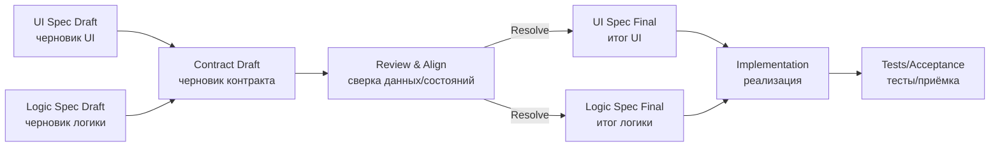

# Цикл GitHub Spec Kit для одной фичи

```mermaid
flowchart LR
  A[UI Spec Draft\nчерновик UI] --> C[Contract Draft\nчерновик контракта]
  B[Logic Spec Draft\nчерновик логики] --> C
  C --> D[Review & Align\nсверка данных/состояний]
  D -->|Resolve| E[UI Spec Final\nитог UI]
  D -->|Resolve| F[Logic Spec Final\nитог логики]
  E --> G[Implementation\nреализация]
  F --> G
  G --> H[Tests/Acceptance\nтесты/приёмка]
```

Примечание: UI и логика согласуются через общий контракт до начала реализации.
