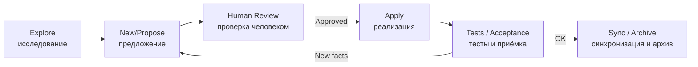

# Цикл OpenSpec для одной фичи

```mermaid
flowchart LR
  A[Explore\nисследование] --> B[New/Propose\nпредложение]
  B --> C[Human Review\nпроверка человеком]
  C -->|Approved| D[Apply\nреализация]
  D --> E[Tests / Acceptance\nтесты и приёмка]
  E -->|OK| F[Sync / Archive\nсинхронизация и архив]
  E -->|New facts| B
```

Примечание: при новых фактах после тестов возвращаемся к propose/update.
