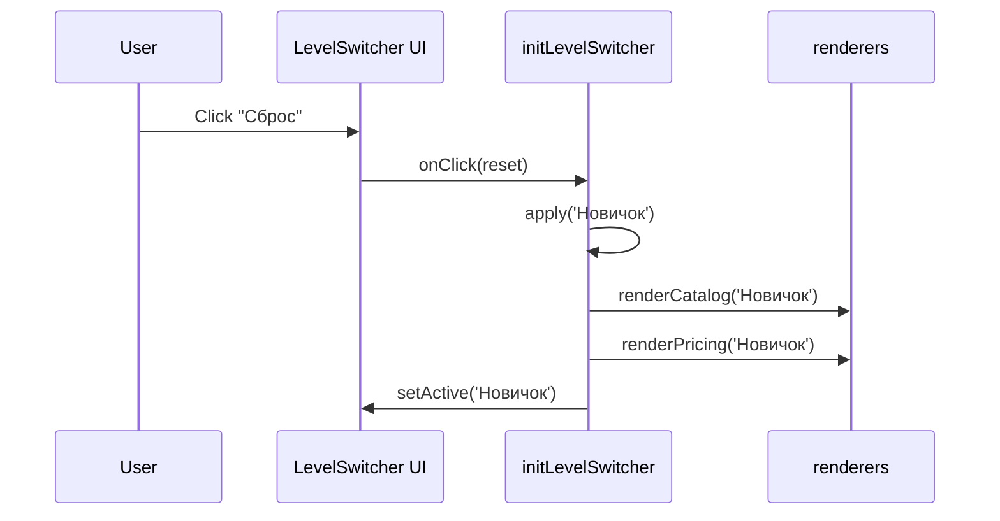

# Фича «Сброс уровня» — последовательность взаимодействий

```mermaid
sequenceDiagram
  participant U as User
  participant UI as LevelSwitcher UI
  participant LS as initLevelSwitcher
  participant R as renderers

  U->>UI: Click "Сброс"
  UI->>LS: onClick(reset)
  LS->>LS: apply('Новичок')
  LS->>R: renderCatalog('Новичок')
  LS->>R: renderPricing('Новичок')
  LS->>UI: setActive('Новичок')
```

Примечание: повторные клики по «Сброс» идемпотентны; состояние остаётся «Новичок» без ошибок.
