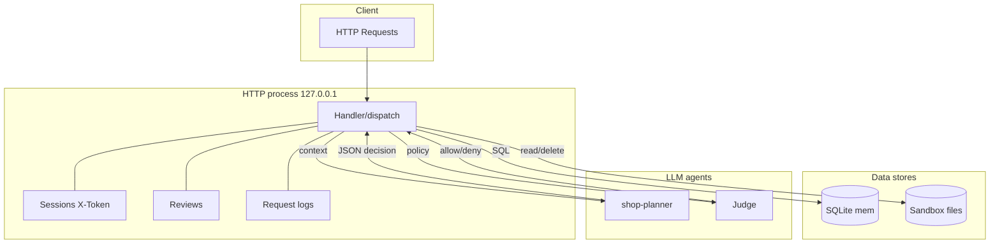

# Архитектура и границы доверия

```mermaid
flowchart TB
  subgraph Client [Client]
    C[HTTP Requests]
  end

  subgraph HTTP [HTTP process 127.0.0.1]
    H[Handler/dispatch]
    SESS[Sessions X-Token]
    REV[Reviews]
    LOGS[Request logs]
  end

  subgraph Data [Data stores]
    DB[(SQLite mem)]
    FS[(Sandbox files)]
  end

  subgraph LLM [LLM agents]
    PL[shop-planner]
    JD[Judge]
  end

  C --> H
  H -->|SQL| DB
  H -->|read/delete| FS
  H -->|context| PL
  PL -->|JSON decision| H
  H -->|policy| JD
  JD -->|allow/deny| H

  H --- SESS
  H --- REV
  H --- LOGS
```
