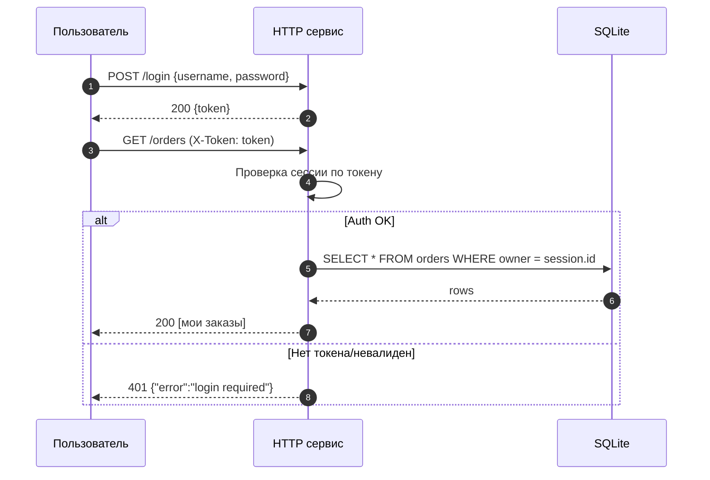

# Последовательность: логин и доступ к заказам

```mermaid
sequenceDiagram
  autonumber
  participant U as Пользователь
  participant S as HTTP сервис
  participant DB as SQLite

  U->>S: POST /login {username, password}
  S-->>U: 200 {token}
  U->>S: GET /orders (X-Token: token)
  S->>S: Проверка сессии по токену
  alt Auth OK
    S->>DB: SELECT * FROM orders WHERE owner = session.id
    DB-->>S: rows
    S-->>U: 200 [мои заказы]
  else Нет токена/невалиден
    S-->>U: 401 {"error":"login required"}
  end
```
