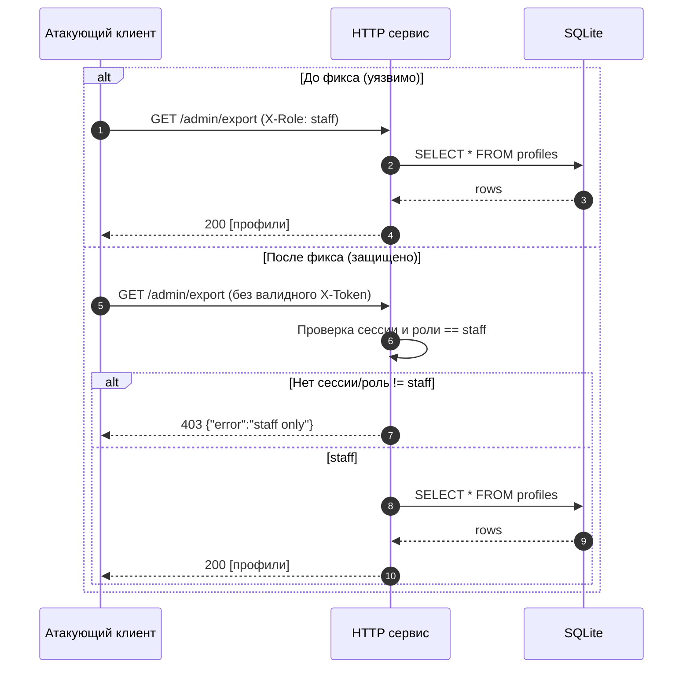

# Admin export: до и после фикса

```mermaid
sequenceDiagram
  autonumber
  participant A as Атакующий клиент
  participant S as HTTP сервис
  participant DB as SQLite

  alt До фикса (уязвимо)
    A->>S: GET /admin/export (X-Role: staff)
    S->>DB: SELECT * FROM profiles
    DB-->>S: rows
    S-->>A: 200 [профили]
  else После фикса (защищено)
    A->>S: GET /admin/export (без валидного X-Token)
    S->>S: Проверка сессии и роли == staff
    alt Нет сессии/роль != staff
      S-->>A: 403 {"error":"staff only"}
    else staff
      S->>DB: SELECT * FROM profiles
      DB-->>S: rows
      S-->>A: 200 [профили]
    end
  end
```
