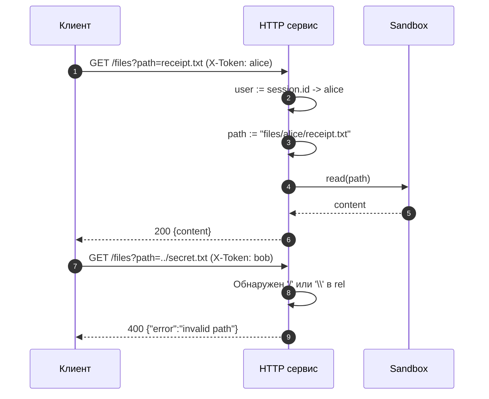

# Доступ к файлам в Sandbox: только свои и без traversal

```mermaid
sequenceDiagram
  autonumber
  participant U as Клиент
  participant S as HTTP сервис
  participant FS as Sandbox

  U->>S: GET /files?path=receipt.txt (X-Token: alice)
  S->>S: user := session.id -> alice
  S->>S: path := "files/alice/receipt.txt"
  S->>FS: read(path)
  FS-->>S: content
  S-->>U: 200 {content}

  U->>S: GET /files?path=../secret.txt (X-Token: bob)
  S->>S: Обнаружен '/' или '\\' в rel
  S-->>U: 400 {"error":"invalid path"}
```
